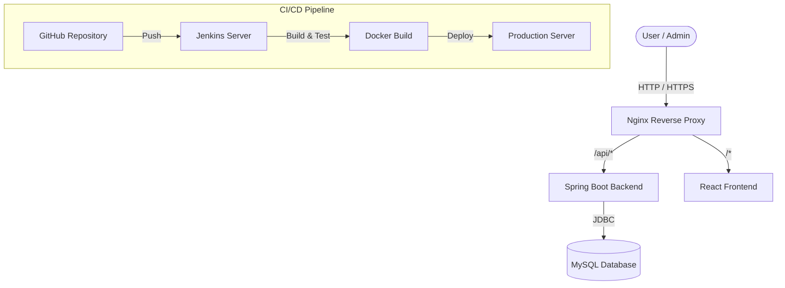

# Smart Parking Reservation System

## Project Overview
The Smart Parking Reservation System is a full-stack web application designed to manage and reserve parking slots efficiently. It provides a seamless experience for users to find and book parking spaces, while offering administrators robust tools to manage slots, view reservations, and monitor system usage.

## Features
- **User Authentication:** Secure login and registration using JWT.
- **Role-Based Access:** Distinct dashboards and permissions for Users and Admins.
- **Slot Management:** Admins can add, update, and remove parking slots.
- **Real-time Reservations:** Users can view available slots and book them in real-time.
- **Dashboard Analytics:** Comprehensive statistics for administrators.

## Architecture Diagram


## Technology Stack
- **Frontend:** React, Vite, TypeScript, Tailwind CSS, Axios, React Router.
- **Backend:** Spring Boot (Java 21), Spring Security, Spring Data JPA, JWT.
- **Database:** MySQL 8.0.
- **Infrastructure:** Docker, Docker Compose, Nginx.
- **CI/CD:** Jenkins.

## Local Setup
1. Clone the repository:
   ```bash
   git clone <repository-url>
   cd smart-parking-reservation
   ```
2. Set up the backend:
   - Ensure Java 21 and Maven are installed.
   - Run the Spring Boot application:
     ```bash
     ./mvnw spring-boot:run
     ```
3. Set up the frontend:
   - Ensure Node.js is installed.
   - Install dependencies and start the development server:
     ```bash
     cd frontend
     npm install
     npm run dev
     ```

## Docker Setup
The project is fully dockerized for easy deployment.

1. Copy the environment variables example file:
   ```bash
   cp .env.example .env
   ```
2. Build and start the containers using Docker Compose:
   ```bash
   docker compose up -d --build
   ```
   This will start the following services:
   - **nginx:** Reverse proxy serving on port 80.
   - **frontend:** React application served via Nginx.
   - **backend:** Spring Boot application running on port 8080.
   - **mysql:** Database running on port 3306.

## Jenkins Setup
The project includes a `Jenkinsfile` for CI/CD.
1. Configure Jenkins to pull from your GitHub repository.
2. Ensure Docker and Docker Compose are installed on the Jenkins server.
3. The pipeline includes the following stages:
   - Checkout
   - Backend Build & Tests
   - Frontend Build & Tests
   - Docker Build (Images tagged with `BUILD_NUMBER` and `latest`)
   - Deploy (Using Docker Compose with a rolling update strategy)

## Deployment Flow
1. Code is pushed to the repository.
2. Jenkins detects the change and triggers the pipeline.
3. Backend and Frontend are built and tested.
4. Docker images are built and tagged appropriately.
5. `docker compose up -d` is executed, which gracefully replaces old containers with new ones (rolling deployment), ensuring no downtime if health checks pass.

## Screenshots Section
*(Add screenshots of the application here)*
- User Dashboard
- Admin Dashboard
- Reservation Flow
- Login/Registration Pages
